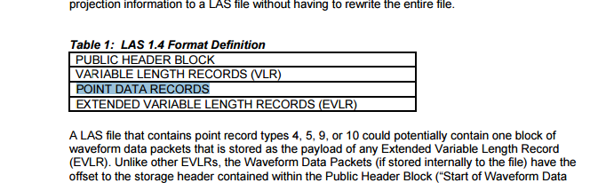
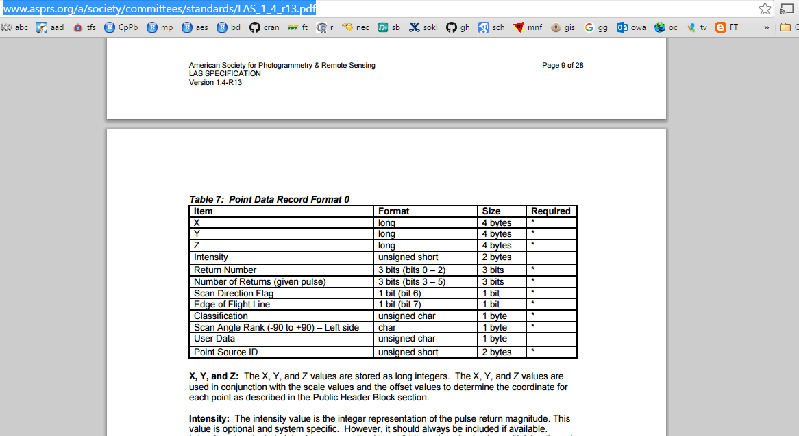

Basic data types in R can be written to and read from basic binary forms. The user-level worker functions are `readBin` and `writeBin`, users of other languages may be familiar with C and Matlab's `fread`, `fwrite`, Fortran's `read`, `write`, C++'s `fstream` support, and similar facilites in most languages. 


# Basic raw data in R 

Create a trivial raw binary file of 5 numeric values, each 64-bit (8 byte) floating point (a.k.a. "double"). 


```{r}
## generate random normally distributed values
(d <- rnorm(5))

## write to raw file
mytempfile <- "wtf.bin"
writeBin(d, con  = mytempfile, size = 8)

## interrogate resulting file (should be 5 * 8 bytes)
print(file.info(mytempfile)$size)
```

Read the entire file and interpret as 5 "double" values, each of size 8 bytes and check that our round-trip was faithful. 

```{r}
rt <- readBin(mytempfile, "numeric", size = 8, n = 5)

print(rt)
```

(This is extremely simplistic and we are ignoring many complications). 

R also has a "raw" atomic vector type, which is handy for the next example. 

```{r}
readBin(mytempfile, what = "raw", n = 5)
```


## Transfer array of data via raw binary file

A slightly more complex example shows a fairly common pathway for sharing data between programs. Here we take the `volcano` matrix, which is a 87x61 array of pixels of elevation values, hand generated by Ross Ihaka sometime around the time R was born. 

```{r}
## load the built-in volcano data set
data(volcano)
## report the data's shape and data range
dim(volcano)
range(volcano)

## visualize the volcano!
image(volcano)

```

Write the values in the `volcano` data set straight out to a raw file, we need to flatten to a non-dimensional "vector" first, and this time 1 byte is sufficient to store all the information in these integer values. 

```{r}
writeBin(as.integer(volcano), "volcano.bin", size = 1)

## switch to foreign program . . .
## 8-bit unsigned integer
## 87 x 61

```

# A more complicated example

We use these basic building blocks and leverage R's vectorization and indexing tricks for a much more complicated file type. 

> The LAS file format is a public file format for the interchange of 3-dimensional point 
> cloud data data between data users.

LAS specification: 
http://www.asprs.org/a/society/committees/standards/LAS_1_4_r13.pdf





## Long story short

We're cheating to make this quick, but a longer program reads the header of a LAS file, determines some sanity tests, and finds these header and metadata values from the header itself: 

```{r}
lasfile <- "5275251.las"
headersize <- 139 
numberPointRecords <- 1210761
offsetToPointData <- 229
pointDataRecordLength <- 28
scale <- function(x) x * 0.01 + 0
```

Those metadata tell us where to start reading point records in the file and how they are aranged. 

```{r}
## open the file
con <- file(lasfile, open = "rb")

## read out the stuff we are not interested in  and discard it
junk <- readBin(con, "raw", size = 1, n = offsetToPointData)
rm(junk)

## slurp in all bytes of all point records
allbytes <- readBin(con, "raw", n = pointDataRecordLength * numberPointRecords, size = 1, endian = "little")
## convert to matrix
allbytes <- matrix(allbytes,  ncol = pointDataRecordLength, nrow = numberPointRecords, byrow = TRUE)

close(con)

```

Now we have the entire file contents in memory, read in very fast in one big binary gulp. 

```{r}
  mm <- matrix(readBin(t(allbytes[, 1:(3 * 4)]), "integer",
                       size = 4, n = 3 * numberPointRecords, endian = "little"),
               ncol = 3, byrow = TRUE)

  intensity <- readBin(t(allbytes[, 13:14]), "integer", size = 2,
                       n = numberPointRecords, signed = FALSE, endian = "little")
  mm<- cbind(scale(mm), intensity)                                                           
  colnames(mm) <- c("x", "y", "z", "intensity")
  
```
  
  Load up rgl and plot
  
  
```{r}
mm[mm[,3] > 100,3] <- 0
asub <- mm[,2] > 5251600
mm1 <- mm[asub,  ]
library(rgl)
scl <- function(x) (x - min(x))/diff(range(x))
plot3d(mm1, col = rainbow(256)[scl(mm1[,1]) * 255 + 1])
aspect3d("iso")

```
